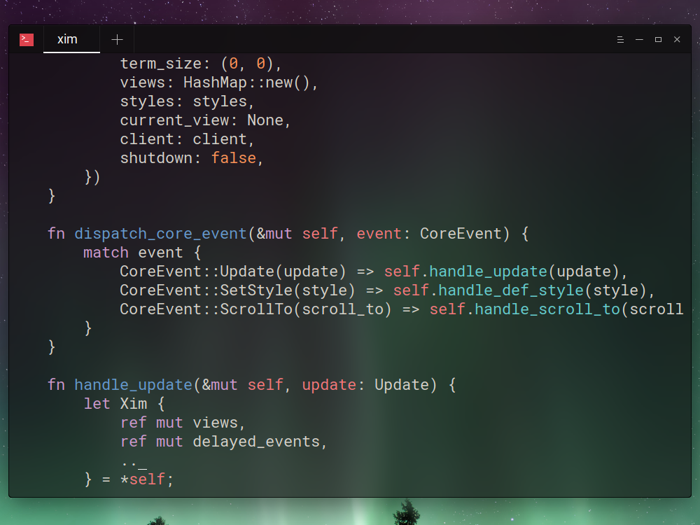

# xim

[](https://travis-ci.org/DestructHub/xim)

`xim` is a minimal terminal frontend for [xi editor](https://github.com/google/xi-editor).

It is experimental and under development, so don't expect anything magical (yet!).

This is a fork which don't have any intention to merge on the original.

## Installation

Assuming that you have installed [xi editor core](https://github.com/google/xi-editor) and you have `~/.cargo/bin` into your `PATH`, the following should suffice:

```bash
# If you want syntax highlighting, download and install the syntect plugin
git clone https://github.com/google/xi-editor
cd xi-editor/rust/syntect-plugin
make install

# Clone this repository and navigate to the project root folder
git clone https://github.com/DestructHub/xim
cd xim

# If you want to install it on your machine
cargo install

# If you just want to run it without installing
cargo run --release -- <filename>
```

To run the editor after installing, use `xim <filename>`.

## Logging

To enable logging, use the parameter `-l <logfile>`. Two files will be written:

- `<logfile>`: `xim` log
- `<logfile>.rpc`: `rpc` messages log

## Screenshots



## Shortcuts

- `^w` Save
- `^c` Exit

## Caveats

### Tabs

We assume tabs (`\t`) are 4 columns large. It that is not the case in
your terminal, the cursor position will be inaccurate. On linux, to
set the `\t` width to four spaces, do:

```
tabs -4
```

### Colors

If you have the `syntect` plugin installed, colors will be enabled by
default, with two caveats:

- You must have true colors enabled. Otherwise, some portions of text
  won't be displayed.
- The default color scheme (for now) is `base16-eighties.dark`.
